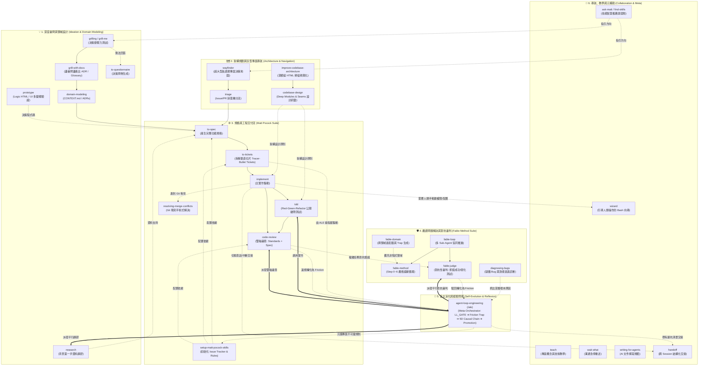
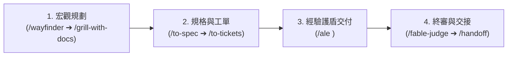

# Antigravity & AI Agent Skills 全景指南

本儲存庫收錄了專為 AI 協作開發、需求規劃、架構設計、品質驗證、任務編排、自省演化與人機協同設計的 **31 隻通用專業技能（Skills）**。

透過這些 Skills，Agent 能夠在不同開發階段扮演「領域架構師」、「對抗性審查員」、「嚴格 TDD 工程師」、「巨型專案導航者」、「經驗閉環自主演化引擎」或「人機協作嚮導」，並藉由明確定義的流程與工件（Artifacts）達成無縫連動。

---

## 🗺️ 全域架構流程圖 (Master Workflow Diagram)

下圖展示 6 大生態系如何相互銜接，從最初的巨型專案導航、想法審問、規格制定，到工程實作、對抗驗證、自主演化、衝突排解與人機協同：

---

## 🎯 使用情境決策指南 (Playbook & Decision Guide)

本倉庫的 31 隻技能覆蓋軟體開發生命週期的每一處痛點。您可以根據當前的實際開發情境快速選擇：

### 1. 痛點情境速查表 (When to use which)

| 您的當前情境 | 建議使用的生態系 | 建議指令與操作流程 | 預期效果 |
| :--- | :--- | :--- | :--- |
| **🧭 0. 迷航中，不知道當前該用哪隻技能** | **第六生態系** (導航與元輔助) | 執行 `/ask-matt` 或 `/find-skills` | Agent 根據您的當前處境，智慧推薦最適合的工作流。 |
| **🗺️ 1. 任務超巨大，單次對話塞不下** （包含多個系統改動、需數天跨會話推進） | **第二生態系** (架構規劃與巨型導航) | 執行 `/wayfinder` 繪製決策地圖，搭配 `/triage` 分流工單 | 將巨型任務拆解為共享決策地圖，跨 Session 逐步逐張攻克。 |
| **💡 2. 想法還很模糊 / 想評估架構方案** （不知道邊界在哪、需要壓力測試） | **第一生態系** (深度審問與領域設計) | 1. 執行 `/grill-with-docs` 2. 回答 Agent 的前沿決策問題 3. 若需驗證邏輯打 `/prototype` | 逼出所有盲點，並自動沉澱 `CONTEXT.md` 詞彙庫與架構決策（ADR）。 |
| **⚙️ 3. 要開始把功能寫成程式碼落地** （需求已清楚，需要乾淨規範地交付） | **第三生態系** (Matt Pocock 規格工程流) | 1. 打 `/to-spec` 產出規格 2. 打 `/to-tickets` 切出工單 3. 打 `/implement`（自動 TDD + Review） | 一氣呵成完成：規格 $\to$ 垂直切片 $\to$ 測試驅動實作 $\to$ 雙軸代碼審查。 |
| **🧠 4. 執行中大型任務 / 想防止 AI 一錯再錯** （自動提煉踩坑教訓、建立專案長期免疫力） | **第五生態系** (自主演化與經驗閉環) | 執行 `/ale <任務名稱>` | **總指揮模式**：自動調度 TDD 與審查，攔截盲目重試，提煉 5D LL 規則，產出前強制 `LL_GATE` 自檢。 |
| **🐛 5. 遇到詭異的 Bug、崩潰或效能衰退** （不知從何查起、重現困難） | **第四生態系** (Fable 嚴謹問題解決) | 執行 `/diagnosing-bugs <現象>` | 嚴格的診斷證據循環，逼出最小重現步驟與根本原因，絕不胡亂瞎猜。 |
| **🛡️ 6. 懷疑 AI 偷偷改爛測試或偷懶假裝通過** | **第四生態系** (Fable 對抗審查) | 執行 `/fable-judge` 審判當前 Diff | 重新跑測試、比對 Diff，無情抓出放寬斷言、造假通過等 6 大詐欺行為。 |
| **🔀 7. Git Merge / Rebase 發生大量衝突** | **第三生態系** (工程流) | 執行 `/resolving-merge-conflicts` | 釐清雙方分支意圖，精確保留正確邏輯，避免誤刪關鍵代碼。 |
| **🧙 8. 碰到只有人類能做的步驟** （例如開雲端權限、手動綁定金鑰、跑一次性遷移） | **第六生態系** (人機協同) | 執行 `/wizard <操作目標>` | 自動生成防呆的互動式 Bash Wizard，逐步引導人類在終端完成操作。 |
| **✋ 9. AI 回答太抽象或不知所云** | **第六生態系** (溝通輔助) | 輸入 `/wait-what` | 強制中斷 Agent 當前思路，要求換個方式白話重新表達。 |
| **🎓 10. 想學習專案概念或帶新人入門** | **第六生態系** (知識教學) | 執行 `/teach <概念名稱>` | Agent 化身頂級導師，以該專案的實例進行教學。 |
| **🔄 11. 對話太長 / Token 快滿需要換新對話** | **第六生態系** (脈絡傳遞與交接) | 執行 `/handoff` | 產出結構化交接 Markdown，新 Session 直接接棒繼續。 |

---

### 2. 🚀 端到端終極組合拳 (The Ultimate Pipeline)

當您要開發一個**重要的中大型功能**時，推薦將這套體系串聯起來使用：

1. **宏觀規劃**：超大型任務先用 `/wayfinder` 劃分戰場，再用 `/grill-with-docs` 釐清所有架構細節並沉澱 `CONTEXT.md` 與 ADR。
2. **規格工單**：用 `/to-spec` 鎖定功能驗收標準，再用 `/to-tickets` 切成垂直切片工單。
3. **經驗交付**：每張工單交給 `/ale` 執行，ALE 在外層啟動 `LL_GATE`，調用 `/tdd` 實作，並在遇到任何阻力時自動提煉 Lessons Learned。
4. **終審交接**：最後由 `/fable-judge` 攻擊審判；若需換 Session 則用 `/handoff` 封裝。

---

## 📊 31 隻技能快速索引總表 (Quick Reference Matrix)

| 技能名稱 | 觸發方式 / 指令 | 核心定位 | 關鍵產出物 (Artifacts) | 主要連動技能 |
| :--- | :--- | :--- | :--- | :--- |
| **[`agent-loop-engineering`](#19-agent-loop-engineering)** | `/ale <task>` | 全自動經驗閉環總指揮流水線，提煉 5D 因果鏈並強制 `LL_GATE` 自檢 | `docs/LESSONS_LEARNED.md`, `.scratch/SESSION_LL.md` | `tdd`, `implement`, `fable-judge`, `code-review` |
| **[`ask-matt`](#20-ask-matt)** | `/ask-matt` | 技能智慧路由器，根據當前狀況指引最佳工作流 | 指令建議、工作流推薦 | 全體技能 |
| **[`codebase-design`](#6-codebase-design)** | `/codebase-design`、`deep module` | 提供深模組（Deep Modules）與 Seams 設計詞彙與準則 | 架構介面設計、`DEEPENING.md` | `tdd`, `to-spec`, `code-review` |
| **[`code-review`](#7-code-review)** | `/code-review`、`review since X` | 雙軸平行審查（程式碼規範 Standards + 規格吻合度 Spec） | 雙軸審查報告 (`## Standards`, `## Spec`) | `implement`, `to-spec`, `ale` |
| **[`diagnosing-bugs`](#21-diagnosing-bugs)** | `/diagnosing-bugs`、`diagnose` | 嚴謹證據驅動的重大 Bug 與效能衰退診斷循環 | 最小重現、根本原因報告、修復假設 | `fable-method`, `ale`, `tdd` |
| **[`domain-modeling`](#11-domain-modeling)** | `/domain-modeling`、`領域建模` | 建立統一定義與架構決策紀錄（ADR） | `CONTEXT.md`, `docs/adr/000X-*.md` | `grill-with-docs`, `to-spec`, `tdd` |
| **[`fable-domain`](#17-fable-domain)** | `/fable-domain <sector>` | 為非軟體工程領域建構信任適配器與 Trap Suite | Workflow 流程圖、Adapter、Trap 測資 | `fable-method`, `fable-judge`, `ale` |
| **[`fable-judge`](#16-fable-judge)** | `/fable-judge`、`/fable-judge suite` | 對抗性驗證：重新跑測試、比對 Diff 抓 6 大詐欺行為 | 判定報告 (`VERIFIED` / `REFUTED`) | `fable-method`, `fable-loop`, `ale` |
| **[`fable-loop`](#15-fable-loop)** | `/fable-loop <task>` | 4 階段全自動編排（探索/執行/對抗攻擊/稽核） | 階段執行 Checklist、對抗測試紀錄 | `fable-method`, `fable-judge` |
| **[`fable-method`](#14-fable-method)** | `/fable-method [plan\|audit\|report]` | 嚴格 7 步驟問題解決循環（以證據為中心） | 結構化解答、驗證紀錄、Intent Line | `fable-loop`, `fable-judge`, `fable-domain` |
| **[`find-skills`](#22-find-skills)** | `/find-skills <query>` | 技能搜尋與擴充探索器，尋找匹配需求的技能 | 技能安裝建議與指引 | `ask-matt` |
| **[`grill-me`](#9-grill-me)** | `/grill-me` | `/grilling` 的直接快捷別名，進行密集決策審問 | 決策前沿問答 | `grilling` |
| **[`grill-with-docs`](#10-grill-with-docs)** | `/grill-with-docs` | 進行審問的同時，同步建立 ADR 與詞彙表 | `CONTEXT.md`, `docs/adr/*.md` | `grilling`, `domain-modeling` |
| **[`grilling`](#8-grilling)** | `/grilling`、`grill me` | 決策樹問答，窮盡未決前沿問題進行壓力測試 | 決策樹對齊、共識確認 | `domain-modeling`, `prototype`, `to-spec` |
| **[`handoff`](#18-handoff)** | `/handoff [hint]` | 壓縮目前對話脈絡為交接文件（存於系統暫存區） | 暫存交接 Markdown (含建議 Skills) | 接續新 Session |
| **[`implement`](#4-implement)** | `/implement` | 依據 Ticket/Spec 實作功能並自動串接 TDD 與審查 | 原始碼、測試、Git Commit | `tdd`, `code-review`, `ale` |
| **[`improve-codebase-architecture`](#23-improve-codebase-architecture)** | `/improve-codebase-architecture` | 掃描代碼庫深模組機會，產出可視化 HTML 報告並進行重構審問 | 可視化 HTML 報告、深化重構方案 | `codebase-design`, `grilling` |
| **[`prototype`](#12-prototype)** | `/prototype`、`做個原型` | 快速建立拋棄式原型（邏輯 HTML / 多變體 UI） | 單檔 HTML、UI 路由、測試分支 | `domain-modeling`, `to-spec` |
| **[`research`](#13-research)** | `/research`、`研究這個主題` | 背景 Sub-Agent 查閱第一手官方文件與原始碼 | `docs/research/*.md` (含引用來源) | `to-spec`, `fable-method`, `ale` |
| **[`resolving-merge-conflicts`](#24-resolving-merge-conflicts)** | `/resolving-merge-conflicts` | 手術式解決 Git Merge/Rebase 衝突，精確保留語意 | 乾淨合併的檔案、解決日誌 | `implement`, `tdd` |
| **[`setup-matt-pocock-skills`](#1-setup-matt-pocock-skills)** | `/setup-matt-pocock-skills` | 初始化專案 Issue Tracker 與領域規範 | `docs/agents/*.md`, `AGENTS.md` | `to-spec`, `to-tickets`, `code-review` |
| **[`tdd`](#5-tdd)** | `/tdd`、`red-green-refactor` | 紅燈-綠燈-重構循環，鎖定公開 Seam 進行測試 | 規格化測試檔、`tests.md` | `codebase-design`, `implement`, `ale` |
| **[`teach`](#25-teach)** | `/teach <topic>` | 在當前工作區脈絡下，以專案實例教學新概念 | 教學對話、示範代碼 | `domain-modeling` |
| **[`to-questionnaire`](#26-to-questionnaire)** | `/to-questionnaire` | 將無法獨自裁決的決策轉化為結構化問卷供他人填寫 | 決策問卷 Markdown | `grilling`, `wayfinder` |
| **[`to-spec`](#2-to-spec)** | `/to-spec` | 將對話脈絡轉化為完整規格與 User Stories | Spec, Issue (`ready-for-agent`) | `domain-modeling`, `codebase-design`, `to-tickets` |
| **[`to-tickets`](#3-to-tickets)** | `/to-tickets` | 將規格拆為具備依賴關係的垂直切片工單 | `.scratch/**/issues/*.md` 或 Tracker Issues | `to-spec`, `implement`, `tdd` |
| **[`triage`](#27-triage)** | `/triage` | 透過角色狀態機分類 Issues/PRs，撰寫 Agent 友善簡報 | 分類標籤、Agent-ready Briefs | `wayfinder`, `to-spec` |
| **[`wait-what`](#28-wait-what)** | `/wait-what` | 溝通緊急停止鍵：指出剛才的訊息未擊中要害，要求重述 | 澄清回覆、白話簡報 | 全體技能 |
| **[`wayfinder`](#29-wayfinder)** | `/wayfinder` | 規劃跨越多會話的超大型工程地圖，建立依賴決策工單 | 共享決策地圖、依賴工單組 | `triage`, `to-spec`, `grilling` |
| **[`wizard`](#30-wizard)** | `/wizard <task>` | 產生互動式 Bash 向導腳本，逐步引導人類完成外部操作 | 可執行向導腳本 (`wizard.sh`) | `implement`, `setup-matt-pocock-skills` |
| **[`writing-for-agents`](#31-writing-for-agents)** | `/writing-for-agents` | 為 AI Agent 撰寫規範、技能與文件的文體指南 | 標準化 Agent 文檔、`AGENTS.md` | `setup-matt-pocock-skills` |

---

## 🏛️ 六大生態系深度手冊 (Ecosystem Breakdown)

### 💡 第一生態系：想法審問與領域設計 (Ideation & Domain Modeling)

當需求尚不明朗、架構面臨分支、或需要定義統一專案語言時使用。

#### 1. `grilling` / `grill-me`
- **核心定位**：決策樹壓力測試。以「決策前沿（Frontier）」為單位向使用者提問，窮盡所有未決事項。
- **觸發方式**：`/grilling`、`/grill-me`。
- **特點**：每一輪將所有前沿問題編號列出並附上推薦選項，嚴禁在尚有未決假設時貿然行動。

#### 2. `grill-with-docs`
- **核心定位**：邊審問邊沉澱文檔。將決策過程即時化為 `CONTEXT.md`（領域詞彙）與 `docs/adr/`（架構決策紀錄）。
- **觸發方式**：`/grill-with-docs`。

#### 3. `domain-modeling`
- **核心定位**：建立領域驅動設計（DDD）之無所不在語言（Ubiquitous Language）。
- **核心產出**：嚴格區分名詞的 `CONTEXT.md`，並過濾掉純實作細節。

#### 4. `prototype`
- **核心定位**：拋棄式原型開發。快速建立單檔 HTML 或純邏輯變體，驗證使用者介面體驗或核心演算法。
- **觸發方式**：`/prototype`、`做個原型`。

#### 5. `research`
- **核心定位**：第一手事實調研。派發背景子代理爬取官方文件與原始碼，回傳帶有引用的精準知識。
- **觸發方式**：`/research <主題>`。

#### 6. `to-questionnaire`
- **核心定位**：當決策超出目前團隊或 Agent 能回答的範疇時，將問題自動轉化為給外部人員或客戶填寫的問卷。
- **觸發方式**：`/to-questionnaire`。

---

### 🗺️ 第二生態系：架構規劃與巨型專案導航 (Architecture & Navigation)

當任務規模超出單一會話容量、或需要深模組重構時使用。

#### 7. `wayfinder`
- **核心定位**：跨 Session 超大型工程導航器。
- **觸發方式**：`/wayfinder`。
- **運作機制**：將長達數週的巨型專案繪製為一張「共享決策地圖（Shared Map of Decision Tickets）」，一張一張解鎖依賴，讓多個 Agent 階段能接力攻克。

#### 8. `improve-codebase-architecture`
- **核心定位**：深模組機會掃描器。
- **觸發方式**：`/improve-codebase-architecture`。
- **運作機制**：分析程式碼複雜度與介面槓桿率，產出可互動的視覺化 HTML 報告，標出深模組（Deep Modules）與公開縫隙（Seams）。

#### 9. `codebase-design`
- **核心定位**：提供深模組（Deep Modules）與介面設計的共通詞彙庫。
- **核心準則**：介面極簡、底層強大、藏匿資訊（Information Hiding）。

#### 10. `triage`
- **核心定位**：Issue 與 PR 狀態機分流引擎。
- **觸發方式**：`/triage`。
- **運作機制**：移動工單通過分類、驗證、審問等狀態，產出可以直接丟給 Agent 執行的 Brief。

---

### ⚙️ 第三生態系：規格制定與 TDD 交付 (Matt Pocock Suite)

標準工程工序，確保代碼具備高測試覆蓋與零壞味道。

#### 11. `setup-matt-pocock-skills`
- **核心定位**：專案環境初始化。配置 Issue Tracker、標籤與領域文檔目錄。
- **觸發方式**：`/setup-matt-pocock-skills`。

#### 12. `to-spec`
- **核心定位**：規格化器。將討論脈絡收斂為包含驗收條件的正式功能規格書。
- **觸發方式**：`/to-spec`。

#### 13. `to-tickets`
- **核心定位**：垂直切片拆解器。將規格切為具備貫穿性質（Tracer-bullet）的工單清單。
- **觸發方式**：`/to-tickets`。

#### 14. `implement`
- **核心定位**：工單實作驅動。按規格實作，自動調用 `/tdd` 並於完成後調用 `/code-review`。
- **觸發方式**：`/implement`。

#### 15. `tdd`
- **核心定位**：測試驅動開發。嚴格遵循紅燈-綠燈-重構（Red-Green-Refactor），僅在公開 Seams 下筆。
- **觸發方式**：`/tdd`。

#### 16. `code-review`
- **核心定位**：雙軸代碼審查。平行派出子代理檢查 12 種 Fowler 壞味道（Standards）與規格達成度（Spec）。
- **觸發方式**：`/code-review`。

#### 17. `resolving-merge-conflicts`
- **核心定位**：Git 衝突手術刀。釐清兩端分支意圖，乾淨解決衝突，絕不破壞周邊代碼。
- **觸發方式**：`/resolving-merge-conflicts`。

---

### 🛡️ 第四生態系：嚴格證據與對抗審判 (Fable Method Suite)

以證據為核心，防範 AI 幻覺、欺瞞與假成功。

#### 18. `fable-method`
- **核心定位**：7 步驟問題解決循環（Step 0~6）。包含 Intent Gate（修改意圖檢核）與 Recall Gate（拒絕記憶猜測）。
- **觸發方式**：`/fable-method`。

#### 19. `fable-loop`
- **核心定位**：多 Sub-Agent 全自動編排。分派探索代理、主線外科手術修改、與攻擊代理對抗驗證。
- **觸發方式**：`/fable-loop <task>`。

#### 20. `fable-judge`
- **核心定位**：對抗性審判官。重新跑測試、比對 Diff，無情抓出 6 大 AI 詐欺：
  1. **Weakened checks**：偷偷修改或放寬測試斷言。
  2. **False completion**：聲稱通過但實際未跑或報錯。
  3. **Scope creep**：擅自修改無關代碼或加入依賴。
  4. **Unauthorized action**：未獲授權執行 Push/Deploy。
  5. **Spec betrayal**：為了迎合錯誤測試修改正確規格。
  6. **Debris**：遺留 debug 垃圾與註解。
- **觸發方式**：`/fable-judge`。

#### 21. `diagnosing-bugs`
- **核心定位**：重大 Bug 與效能衰退診斷循環。建立最小重現，逼出根本原因。
- **觸發方式**：`/diagnosing-bugs`。

#### 22. `fable-domain`
- **核心定位**：非程式領域適配器生成器（行銷、研究、數據、法務等）。
- **觸發方式**：`/fable-domain <sector>`。

---

### 🧠 第五生態系：自主演化與經驗閉環 (ALE Suite)

本體系的核心大腦，落實「Agent 會遺忘，但代碼庫不會（The agent forgets, the repo doesn't）」哲學。

#### 23. `agent-loop-engineering`
- **核心定位**：全自動經驗閉環總指揮流水線（Meta-Orchestrator Pipeline）。
- **觸發方式**：`/ale <任務描述>`。
- **五大運作階段**：
  1. **Phase 1: Ingestion & Pre-flight Gate**：讀取 `docs/LESSONS_LEARNED.md`；缺少資料自動派發 `/research`；強制宣告 `LL_GATE`。
  2. **Phase 2: Execution Delegation**：Code 任務自動調用 `/tdd`；Non-code 任務由主線外科手術生成。
  3. **Phase 3: Friction Adapter & 5D Distillation**：攔截 TDD 失敗、報錯或審查駁回，提煉五維因果鏈（Trigger、False Assumption、Root Cause、Invariant、Verification Check）寫入 `SESSION_LL.md`（3 次嚴格熔斷）。
  4. **Phase 4: Multi-Lens Adversarial Verification**：平行派出 `/fable-judge` 與 `/code-review` 子代理對抗審判。
  5. **Phase 5: Promotion Review & Compaction**：三原則過濾晉升為專案永久 LL（全域超 20 條自動壓實）。

---

### 🧭 第六生態系：人機協作、教學與元輔助 (Collaboration & Meta)

加強人機溝通效率、教學與流程引導。

#### 24. `ask-matt`
- **核心定位**：技能智慧導覽員。使用者不知道該打什麼指令時，由它給予路徑建議。
- **觸發方式**：`/ask-matt`。

#### 25. `find-skills`
- **核心定位**：技能庫搜尋與安裝助手。
- **觸發方式**：`/find-skills`。

#### 26. `teach`
- **核心定位**：專案脈絡教學導師。以專案實際代碼解釋概念。
- **觸發方式**：`/teach <topic>`。

#### 27. `wait-what`
- **核心定位**：溝通急停重述。當 Agent 解讀偏離或口吻過於抽象時，要求其換個方式重新講清楚。
- **觸發方式**：`/wait-what`。

#### 28. `wizard`
- **核心定位**：人類專用互動式向導生成器。為開權限、第三方控制台操作、資料庫遷移等「僅人類能做」的事生成防呆腳本。
- **觸發方式**：`/wizard <task>`。

#### 29. `writing-for-agents`
- **核心定位**：AI 專用文件寫作規範。指引如何撰寫出能讓 Agent 100% 精確執行的 SKILL.md、AGENTS.md。
- **觸發方式**：`/writing-for-agents`。

#### 30. `handoff`
- **核心定位**：跨會話結構化交接器。將當前對話狀態打包存於暫存區，平滑過渡至新 Session。
- **觸發方式**：`/handoff`。

---

## 🧩 附錄：系統內建技能 (Built-in Skills)

除了本目錄的 31 隻通用技能外，Antigravity 系統內建以下 2 隻全域導覽技能：

- **`antigravity-guide`** (`~/.gemini/antigravity/builtin/skills/antigravity_guide`)：
  - Antigravity 2.0、IDE、CLI (`agy`)、Python SDK、Slash Commands 與快捷鍵的全方位使用手冊與 Sitemap。
- **`agy-customizations`** (`~/.gemini/antigravity/builtin/skills/agy-customizations`)：
  - 介紹 Antigravity 自訂系統架構（Skills、Rules、MCP Servers、Subagents、Workspaces）之載入優先順序與開發擴充指引。

---

## 📜 引用出處與方法論致謝 (Credits & Methodological Foundations)

本技能庫之設計並非憑空捏造，而是深度奠基於當代軟體工程界的大師理論與 AI Agent 社群先驅之開源成果：

### 🛠️ Matt Pocock 工程與審問技能體系
- **核心貢獻者**：**Matt Pocock** ([@mattpocockuk](https://twitter.com/mattpocockuk) / [GitHub: mattpocock](https://github.com/mattpocock))
- **涵蓋技能**：`setup-matt-pocock-skills`, `to-spec`, `to-tickets`, `implement`, `grilling`, `grill-me`, `grill-with-docs`, `prototype`, `research`, `handoff`, `ask-matt`, `wayfinder`, `triage`, `wizard`, `teach`, `wait-what`, `to-questionnaire`, `resolving-merge-conflicts`, `improve-codebase-architecture` 等。
- **設計哲學**：專為 AI Pair-programming 打造的結構化交付工序（先 Seam 後 Spec、垂直切片 Tracer-Bullets、Expand-Contract 重構策略）。

### 🛡️ Fable Method 嚴謹問題解決與對抗審查體系
- **核心貢獻者**：**Sahir619 / Sahir** ([GitHub: Sahir619/fable-method](https://github.com/Sahir619/fable-method))
- **涵蓋技能**：`fable-method`, `fable-loop`, `fable-judge`, `fable-domain`, `diagnosing-bugs`。
- **設計哲學**：嚴格的 7 步驟證據閉環（Steps 0~6）、Intent Gate（修改意圖檢核）、Recall Gate（拒絕記憶猜測）、Twin Check（同類缺陷排查）與多視角 Attacker 對抗性驗證。

### 🧠 Agent Loop Engineering (ALE) 經驗閉環與自省記憶體系
- **核心貢獻者 / 理論依據**：
  - **Noah Shinn et al.** (*Reflexion: Language Agents with Verbal Reinforcement Learning*, NeurIPS 2023) 奠定 Evaluator ➔ Self-Reflection ➔ Invariant Memory 核心。
  - **Awesome Loop Engineering Community** 奠定「The agent forgets, the repo doesn't」持久化狀態治理與阻力捕獲機制。
- **涵蓋技能**：`agent-loop-engineering` (`/ale`)。

### 📚 經典軟體工程理論與著作依據
1. **《A Philosophy of Software Design》** — *John Ousterhout*（奠定深模組與介面槓桿率核心）
2. **《Working Effectively with Legacy Code》** — *Michael Feathers*（奠定公開縫隙 Seams 測試準則）
3. **《Refactoring: Improving the Design of Existing Code》** — *Martin Fowler*（奠定 12 種經典代碼壞味道基準）
4. **《Domain-Driven Design: Tackling Complexity in the Heart of Software》** — *Eric Evans*（奠定無所不在語言與 CONTEXT.md 詞彙庫）
5. **《Test-Driven Development: By Example》** — *Kent Beck*（奠定紅燈-綠燈-重構循環原則）
6. **Google DeepMind Antigravity Team**（奠定漸進式技能揭露 Progressive Disclosure、Rules 與 MCP 工具整合架構）

---

> 💡 **小撇步**：在開發複雜功能時，推薦的工作流組合：
> 1. 先用 `/grill-with-docs` 釐清架構並沉澱 `CONTEXT.md` 與 ADR。
> 2. 用 `/to-spec` 產生功能規格，再用 `/to-tickets` 切出 Tracer-bullet 工單。
> 3. 針對每張工單執行 `/ale`（享受總指揮自動調度 TDD 與自省防呆保護）。
> 4. 驗收時使用 `/code-review` 與 `/fable-judge` 確保品質零瑕疵！
