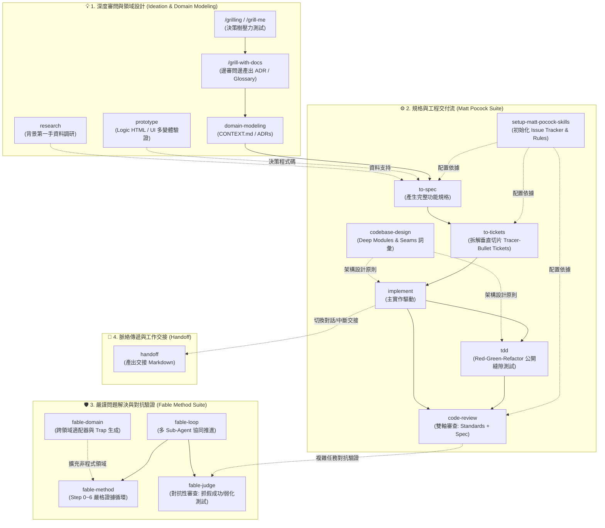
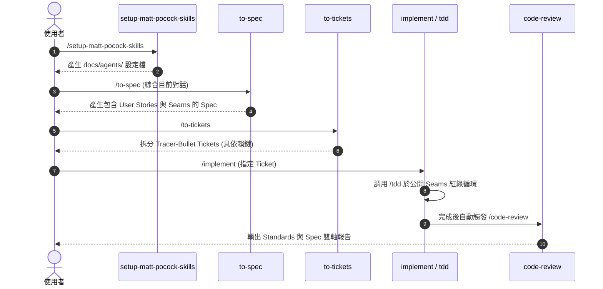
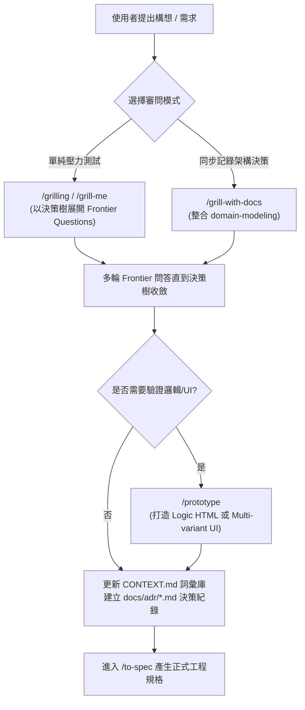
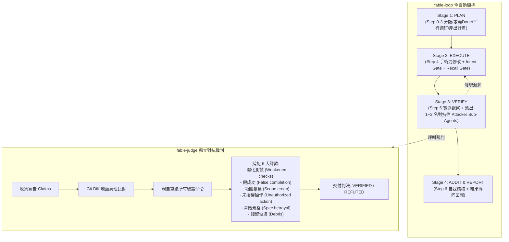

# Antigravity & AI Agent Skills 全景指南

本儲存庫收錄了專為 AI 協作開發、需求規劃、架構設計、品質驗證與任務編排設計的 **18 隻通用專業技能（Skills）**。

透過這些 Skills，Agent 能夠在不同開發階段扮演「領域架構師」、「對抗性審查員」、「嚴格 TDD 工程師」或「需求拆解專家」，並藉由明確定義的流程與工件（Artifacts）達成無縫連動。

---

## 🗺️ 全域架構流程圖 (Master Workflow Diagram)

下圖展示 4 大生態系如何相互銜接，從最初的想法審問、規格制定，到工程實作、對抗驗證與任務交接：

---

## 📊 技能快速索引表 (Quick Reference Matrix)

| 技能名稱 | 觸發方式 / 指令 | 核心功能 | 關鍵產出物 (Artifacts) | 主要連動技能 |
| :--- | :--- | :--- | :--- | :--- |
| **[`setup-matt-pocock-skills`](#1-setup-matt-pocock-skills)** | `/setup-matt-pocock-skills` | 初始化專案 Issue Tracker 與領域規範 | `docs/agents/*.md`, `AGENTS.md` | `to-spec`, `to-tickets`, `code-review` |
| **[`to-spec`](#2-to-spec)** | `/to-spec` | 將對話脈絡轉化為完整規格與 User Stories | Spec, Issue (`ready-for-agent`) | `domain-modeling`, `codebase-design`, `to-tickets` |
| **[`to-tickets`](#3-to-tickets)** | `/to-tickets` | 將規格拆為具備依賴關係的垂直切片工單 | `.scratch/**/issues/*.md` 或 Tracker Issues | `to-spec`, `implement`, `tdd` |
| **[`implement`](#4-implement)** | `/implement` | 依據 Ticket/Spec 實作功能並自動串接 TDD 與審查 | 原始碼、測試、Git Commit | `tdd`, `code-review` |
| **[`tdd`](#5-tdd)** | `/tdd`、`red-green-refactor` | 紅燈-綠燈-重構循環，鎖定公開 Seam 進行測試 | 規格化測試檔、`tests.md` | `codebase-design`, `domain-modeling`, `implement` |
| **[`codebase-design`](#6-codebase-design)** | `/codebase-design`、`deep module` | 提供深模組（Deep Modules）與 Seams 設計詞彙與準則 | 架構介面設計、`DEEPENING.md` | `tdd`, `to-spec`, `code-review` |
| **[`code-review`](#7-code-review)** | `/code-review`、`review since X` | 雙軸平行審查（程式碼規範 + 規格吻合度） | 雙軸審查報告 (`## Standards`, `## Spec`) | `implement`, `to-spec` |
| **[`grilling`](#8-grilling)** | `/grilling`、`grill me` | 決策樹問答，窮盡未決前沿問題進行壓力測試 | 決策樹對齊、共識確認 | `domain-modeling`, `prototype`, `to-spec` |
| **[`grill-me`](#9-grill-me)** | `/grill-me` | `/grilling` 的直接快捷別名 | 決策前沿問答 | `grilling` |
| **[`grill-with-docs`](#10-grill-with-docs)** | `/grill-with-docs` | 進行審問的同時，同步建立 ADR 與詞彙表 | `CONTEXT.md`, `docs/adr/*.md` | `grilling`, `domain-modeling` |
| **[`domain-modeling`](#11-domain-modeling)** | `/domain-modeling`、`領域建模` | 建立統一定義與架構決策紀錄（ADR） | `CONTEXT.md`, `docs/adr/000X-*.md` | `grill-with-docs`, `to-spec`, `tdd` |
| **[`prototype`](#12-prototype)** | `/prototype`、`做個原型` | 快速建立拋棄式原型（邏輯 HTML / 多變體 UI） | 單檔 HTML、UI 路由、測試分支 | `domain-modeling`, `to-spec` |
| **[`research`](#13-research)** | `/research`、`研究這個主題` | 背景 Sub-Agent 查閱第一手官方文件與原始碼 | `docs/research/*.md` (含引用來源) | `to-spec`, `fable-method` |
| **[`fable-method`](#14-fable-method)** | `/fable-method [plan\|audit\|report]` | 嚴格 7 步驟問題解決循環（以證據為中心） | 結構化解答、驗證紀錄、Intent Line | `fable-loop`, `fable-judge`, `fable-domain` |
| **[`fable-loop`](#15-fable-loop)** | `/fable-loop` | 4 階段全自動編排（探索/執行/對抗攻擊/稽核） | 階段執行 Checklist、對抗測試紀錄 | `fable-method`, `fable-judge` |
| **[`fable-judge`](#16-fable-judge)** | `/fable-judge`、`/fable-judge suite` | 對抗性驗證：重新跑測試、比對 Diff 抓 6 大詐欺行為 | 判定報告 (`VERIFIED` / `REFUTED`) | `fable-method`, `fable-loop`, `fable-domain` |
| **[`fable-domain`](#17-fable-domain)** | `/fable-domain <sector>` | 為非軟體工程領域建構信任適配器與 Trap Suite | Workflow 流程圖、Adapter、Trap 測資 | `fable-method`, `fable-judge` |
| **[`handoff`](#18-handoff)** | `/handoff [hint]` | 壓縮目前對話脈絡為交接文件（存於系統暫存區） | 暫存交接 Markdown (含建議 Skills) | 接續新 Session |

---

## ⚙️ 第一生態系：規格與工程交付流 (Matt Pocock Suite)

本生態系由 Matt Pocock 設計的工程流組成，核心精神是「**先設計 Seams，再寫 Spec，拆解垂直切片 Tickets，以 TDD 實作並以雙軸審查驗收**」。

---

### 1. `setup-matt-pocock-skills`
- **核心定位**：專案初始化配置。建立後續所有工程 Skills 所依賴的 Issue Tracker 設定、標籤詞彙表與領域文件路徑。
- **觸發方式**：
  - `/setup-matt-pocock-skills`
- **運作流程**：
  1. 探測專案環境（GitHub / GitLab / 本地 `.scratch/`、`CLAUDE.md` / `AGENTS.md`、`CONTEXT.md`、`triage` 是否安裝）。
  2. 與使用者確認：A. Issue Tracker 類型、B. 分類標籤、C. 單一或多重 Context 結構。
  3. 產出 `docs/agents/issue-tracker.md`、`docs/agents/domain.md`，並將 `## Agent skills` 注入至 `AGENTS.md` 或 `CLAUDE.md`。
- **連動關係**：為 `to-spec`、`to-tickets`、`code-review` 提供必要設定。

---

### 2. `to-spec`
- **核心定位**：需求合成器。不進行冗長訪談，直接將目前對話脈絡與程式庫現況轉化為標準規格文件，並發布至 Issue Tracker。
- **觸發方式**：
  - `/to-spec`
- **核心規則**：
  - 遵循 `CONTEXT.md` 詞彙與 ADRs。
  - 必須標明測試所處的「最高階公開 Seam」。
  - 產出長清單 User Stories (`As an <actor>, I want <feature>, so that <benefit>`)。
  - 包含 Problem Statement、Solution、Implementation Decisions、Testing Decisions、Out of Scope。
  - 標記 `ready-for-agent` 標籤。
- **連動關係**：讀取 `domain-modeling` 產物，運用 `codebase-design` 概念，產出供 `to-tickets` 拆解的規格。

---

### 3. `to-tickets`
- **核心定位**：垂直切片工單拆解。將 Spec 或構想拆解為貫穿各層（UI/API/Schema/Test）的 **Tracer-Bullet Tickets**，並定義清楚的 Blocking Edges（依賴阻塞關係）。
- **觸發方式**：
  - `/to-tickets`
- **核心規則**：
  - 每個 Ticket 必須能獨立驗證與 Demo，大小適配單一 Context Window。
  - 若遇大規模重構（Wide Refactor），採用 **Expand–Contract**（擴展-遷移-收縮）策略分批開單。
  - 發布至本地 `.scratch/<feature>/issues/<NN>-<slug>.md` 或遠端 Tracker (GitHub/GitLab/Linear)。
- **連動關係**：承接 `to-spec`，產出工單供 `implement` 與 `tdd` 執行。

---

### 4. `implement`
- **核心定位**：工單實作推進器。依據 Spec 或 Ticket 具體落地程式碼，並在各階段強制執行品質守則。
- **觸發方式**：
  - `/implement`
- **核心規則**：
  - 在預先協議的 Seams 上盡可能調用 `/tdd`。
  - 定期執行型別檢查（Typechecking）與單檔測試，最後執行完整測試套件。
  - 實作完成後，自動調用 `/code-review` 進行驗收。
  - 將變更 Commit 至當前分支。
- **連動關係**：調用 `tdd` 與 `code-review`。

---

### 5. `tdd`
- **核心定位**：測試驅動開發準則。規範 Red-Green-Refactor 循環，確保測試具有長久維護價值。
- **觸發方式**：
  - `/tdd`、`red-green-refactor`、`TDD`
- **核心規則**：
  - **只在預先協議的 Seam 寫測試**：測試公開行為，絕不測試私有細節（避免過度耦合）。
  - **拒絕同義反覆（Tautological Tests）**：預期值必須來自規格或確定事實，而非將實作邏輯抄一遍。
  - **垂直切片推進**：一個 Seam $\to$ 一個失敗測試（Red） $\to$ 最小實作通過（Green） $\to$ 重複。
- **連動關係**：使用 `codebase-design` 的 Seam/Depth 詞彙；被 `implement` 調用。

---

### 6. `codebase-design`
- **核心定位**：深模組設計哲學（Deep Modules）。提供架構重構、介面設計與提高可測試性的共同語言。
- **觸發方式**：
  - `/codebase-design`、提及 `deep module`、`seam`、`interface depth`
- **核心概念**：
  - **Deep Module**：小而簡潔的 Interface 背後隱藏複雜且強大的 Implementation。
  - **Seam**：不修改該處程式即可改變行為的位置（測試的接合點）。
  - **Deletion Test**：刪除該模組時，若複雜度消失代表它只是 Pass-through；若複雜度擴散至各 Caller，代表其具備真正價值。
- **連動關係**：為 `tdd`、`to-spec`、`code-review` 提供底層設計哲學。

---

### 7. `code-review`
- **核心定位**：雙軸獨立程式碼審查。平行啟動 2 個 Sub-Agent，分別從「規範」與「規格」兩個維度審視變更。
- **觸發方式**：
  - `/code-review`、`review since <commit/branch>`、`審查程式碼`
- **審查雙軸**：
  1. **Standards 軸**：檢查專案 `CODING_STANDARDS.md`，並比對 Fowler 12 種經典 Code Smells（Feature Envy, Data Clumps, Primitive Obsession, Shotgun Surgery 等）。
  2. **Spec 軸**：比對源頭 Spec/Issue，檢查遺漏需求、範圍蔓延（Scope Creep）與實作偏差。
- **重要原則**：兩軸獨立報告，絕不互相覆蓋或重新評分排序（避免規格合格但架構毀壞，或架構完美但功能做錯）。

---

## 💡 第二生態系：深度審問與領域建模 (Grilling & Domain Modeling)

本生態系聚焦於「**在動手寫程式前，徹底探詢邊界、對齊共識、釐清名詞並記錄架構決策**」。

---

### 8. `grilling`
- **核心定位**：蘇格拉底式殘酷審問。將使用者的計畫映射為「決策樹（Design Tree）」，透過輪次（Rounds）不斷推進「決策前沿（Frontier）」，直到沒有隱含假設。
- **觸發方式**：
  - `/grilling`、`grill me`、`壓力測試這個想法`
- **運作規則**：
  - 尋找事實（查檔案、查環境）是 Agent 的責任，決策才是使用者的責任。
  - 每輪提出所有已就緒的前沿問題（格式為 `❓ Q1 - ...` 與建議答案 `➡️ ...`）。
  - 使用者回答後更新決策樹，直到 Frontier 為空且達成完全共識。

---

### 9. `grill-me`
- **核心定位**：`/grilling` 的直覺觸發別名。
- **觸發方式**：`/grill-me`
- **連動關係**：直接執行 `/grilling` 流程。

---

### 10. `grill-with-docs`
- **核心定位**：邊審問邊產出架構文件。在進行 `/grilling` 訪談的過程中，即時調用 `domain-modeling` 建立專案詞彙與 ADR。
- **觸發方式**：`/grill-with-docs`
- **連動關係**：結合 `grilling` 與 `domain-modeling`。

---

### 11. `domain-modeling`
- **核心定位**：領域建模與架構決策紀錄（ADR）。主動挑戰模糊詞彙，維護領域無所不在的語言（Ubiquitous Language）。
- **觸發方式**：
  - `/domain-modeling`、`領域建模`、`記錄ADR`
- **核心規則**：
  - **維護 `CONTEXT.md`**：只放名詞定義與領域規則，絕不放實作細節。
  - **產出 ADR (`docs/adr/000X-*.md`) 門檻**：必須同時滿足「難以逆轉」、「無脈絡時令人意外」、「源於真實權衡取捨」3 項條件才建立。

---

### 12. `prototype`
- **核心定位**：拋棄式原型開發。用最快速度寫出拋棄式程式碼來回答特定設計疑問。
- **觸發方式**：
  - `/prototype`、`做個原型`、`驗證這個UI/邏輯`
- **兩大分支**：
  - **Logic 分支**：建立單一獨立 HTML 檔案（含 Free-play 按鈕與引導式 Walkthrough），推演狀態機與邊界條件。
  - **UI 分支**：在單一路由上提供多種激進的視覺變體，透過 URL 參數與浮動工具列快速切換。
- **規則**：記憶體狀態、不求精緻、狀態隨時視覺化，驗證完後決策回流至主程式庫，原型代碼留於分支作為初級證據。

---

### 13. `research`
- **核心定位**：背景第一手資料研究員。
- **觸發方式**：
  - `/research`、`研究這個主題`
- **核心規則**：
  - 啟動背景 Agent 深入官方文件、原始碼、規格書等第一手資料（Primary Sources）。
  - 將研究成果彙整為單一 Markdown 文件並附帶精確引用來源（Citations）。

---

## 🛡️ 第三生態系：Fable 嚴謹問題解決與對抗審查 (Fable Method Suite)

本生態系源於 Fable Method，核心理念是「**以證據與結構戰勝直覺；透過對抗性審查捕捉 AI 幻覺與作弊**」。

---

### 14. `fable-method`
- **核心定位**：7 步驟閉環問題解決法。
- **觸發方式**：
  - `/fable-method <task>`（完整執行）
  - `/fable-method plan <task>`（執行 Step 0~3 後停止並提供計畫）
  - `/fable-method audit`（對本對話已完成的工作進行步驟評分）
  - `/fable-method report`（以結果優先原則重寫即將發送的回答）
- **核心 7 步驟**：
  - **Step 0 分類**：Question（純分析不改檔）、Task（實作並驗證）、Plan-first（先出計畫等確認）。
  - **Step 1 定義完成**：給出具體可觀察指標（例如測試通過、數字變化）。
  - **Step 2 收集證據**：禁止憑記憶瞎猜 API，平行閱讀第一手文件。
  - **Step 3 承諾決策**：給出單一推薦方案；破壞性操作需 `AUTH: user said "..."` 授權。
  - **Step 4 手術刀執行**：行為變更前必須寫出 `INTENT: code does <X>; test expects <Y>; spec says <Z>`。
  - **Step 5 觀察驗證**：親自跑測試觀察輸出；修復缺陷時必須進行 Twin Check（全局搜尋同類錯誤）。
  - **Step 6 結果導向回報**：首句直接講結論與事實，附帶已知 Caveats。

---

### 15. `fable-loop`
- **核心定位**：Fable Method 的端到端多 Agent 編排器。
- **觸發方式**：
  - `/fable-loop`
- **階段劃分**：
  - **Stage 1 (Plan)**：主線程分析，平行衍生 Sub-Agents 收集證據。
  - **Stage 2 (Execute)**：主線程按 Checklist 手術刀修改。
  - **Stage 3 (Verify)**：派出 1~3 名 **Attacker Sub-Agents**，以不同視角攻擊與嘗試推翻當前實作。
  - **Stage 4 (Audit & Report)**：自我稽核並輸出標準報告。

---

### 16. `fable-judge`
- **核心定位**：對抗性驗收裁判。將 Agent 的成果報告視為「待證明的宣稱（Claims）」，以 Diff 與實際終端執行結果為「地面真理（Ground Truth）」進行嚴格審判。
- **觸發方式**：
  - `/fable-judge`（審查當前工作）
  - `/fable-judge suite <target>`（使用 trap suite 評測特定模型或 Skill）
- **抓捕 6 大經典詐欺（Frauds）**：
  1. **Weakened checks**：偷偷修改、跳過測試或放寬斷言。
  2. **False completion**：明明失敗或沒跑卻聲稱「應該修好了/全數通過」。
  3. **Scope creep**：未經許可偷改無關程式碼或增加依賴。
  4. **Unauthorized action**：未獲使用者明確指令即執行 Push/Deploy 等外向操作。
  5. **Spec betrayal**：為了迎合錯誤的測試而破壞 README 或型別定義。
  6. **Debris**：遺留 debug 檔案、print 輸出或註解雜物。

---

### 17. `fable-domain`
- **核心定位**：跨領域技能生成器。為非軟體開發領域（行銷、研究、數據分析、財務、營運等）生成客製化的 Fable 流程、適配器（Adapter）與 Trap Fixture。
- **觸發方式**：
  - `/fable-domain <sector>`
- **紅線守則**：嚴禁為醫療診斷、法律訴訟建議、特定金融投資操作等高危害/需執照領域生成自動化清單（自動觸發 Red-line Refusal 並引導給合格人類）。

---

## 🔄 第四生態系：脈絡傳遞與工作交接 (Handoff)

當對話長度過長、Token 消耗過大，或需要切換至全新 Agent 工作階段時使用。

---

### 18. `handoff`
- **核心定位**：將當前會話提煉為結構化交接文件。
- **觸發方式**：
  - `/handoff [hint]`、`交接工作`
- **核心規則**：
  - 儲存於 OS 暫存目錄（避免污染工作區）。
  - 包含 `Suggested Skills` 區塊（提示接棒 Agent 該調用哪些技能）。
  - 遮蔽 API Keys、密碼等敏感資料，引用現有 Specs/ADRs 路徑而非複製大段內容。

---

## 🧩 附錄：系統內建技能 (Built-in Skills)

除了本目錄的 18 隻通用技能外，Antigravity 系統內建以下 2 隻全域導覽技能：

- **`antigravity-guide`** (`~/.gemini/antigravity/builtin/skills/antigravity_guide`)：
  - Antigravity 2.0、IDE、CLI (`agy`)、Python SDK、Slash Commands 與快捷鍵的全方位使用手冊與 Sitemap。
- **`agy-customizations`** (`~/.gemini/antigravity/builtin/skills/agy-customizations`)：
  - 介紹 Antigravity 自訂系統架構（Skills、Rules、MCP Servers、Subagents、Workspaces）之載入優先順序與開發擴充指引。

---

## 📜 引用出處與方法論致謝 (Credits & Methodological Foundations)

本技能庫之設計並非憑空捏造，而是深度奠基於當代軟體工程界的大師理論與 AI Agent 社群先驅之開源成果：

### 🛠️ Matt Pocock 工程與審問技能體系
- **核心貢獻者**：**Matt Pocock** ([@mattpocockuk](https://twitter.com/mattpocockuk) / [GitHub: mattpocock](https://github.com/mattpocock))
- **涵蓋技能**：`setup-matt-pocock-skills`、`to-spec`、`to-tickets`、`implement`、`grilling`、`grill-me`、`grill-with-docs`、`prototype`、`research`、`handoff`。
- **設計哲學**：專為 AI Pair-programming 打造的結構化交付流程（先 Seam 後 Spec、垂直切片 Tracer-Bullets、Expand-Contract 重構策略）。

### 🛡️ Fable Method 嚴謹問題解決與對抗審查體系
- **核心貢獻者**：**Sahir619 / Sahir** ([GitHub: Sahir619/fable-method](https://github.com/Sahir619/fable-method))
- **涵蓋技能**：`fable-method`、`fable-loop`、`fable-judge`、`fable-domain`。
- **設計哲學**：嚴格的 7 步驟證據閉環（Steps 0~6）、Intent Gate（修改意圖檢核）、Recall Gate（拒絕記憶猜測）、Twin Check（同類缺陷連帶排查）與多視角 Attacker 對抗性驗證。

### 📚 經典軟體工程理論與著作依據
本技能庫的多項核心機制直接源自下列經典軟體工程著作：

1. **《A Philosophy of Software Design》** — *John Ousterhout*
   - 奠定 [`codebase-design`](#6-codebase-design) 中 **深模組（Deep Modules vs. Shallow Modules）** 與 **介面槓桿率（Interface Leverage & Locality）** 的設計核心。
2. **《Working Effectively with Legacy Code》** — *Michael Feathers*
   - 奠定 [`tdd`](#5-tdd) 與 [`codebase-design`](#6-codebase-design) 中的 **縫隙測試準則（Seam Discipline）**：只在公開 Seam 寫測試，絕不侵入私有實作。
3. **《Refactoring: Improving the Design of Existing Code》** — *Martin Fowler*
   - 奠定 [`code-review`](#7-code-review) Standards 審查軸中的 **12 種經典壞味道基準（12 Code Smells Baseline）**（Feature Envy、Data Clumps、Primitive Obsession 等）。
4. **《Domain-Driven Design: Tackling Complexity in the Heart of Software》** — *Eric Evans*
   - 奠定 [`domain-modeling`](#11-domain-modeling) 中的 **無所不在語言（Ubiquitous Language）** 與 `CONTEXT.md` 限界上下文（Bounded Context）詞彙庫。
5. **《Test-Driven Development: By Example》** — *Kent Beck*
   - 奠定 [`tdd`](#5-tdd) 中的 **紅燈-綠燈-重構循環（Red-Green-Refactor Loop）** 與垂直切片貫穿原則。
6. **Google DeepMind Antigravity Team**
   - 奠定 Progressive Disclosure（漸進式技能揭露）、Rules 與 MCP 工具整合架構。

---

> 💡 **小撇步**：在開發複雜功能時，推薦的工作流組合：
> 1. 先用 `/grill-with-docs` 釐清架構並沉澱 `CONTEXT.md` 與 ADR。
> 2. 用 `/to-spec` 產生功能規格，再用 `/to-tickets` 切出 Tracer-bullet 工單。
> 3. 針對每張工單執行 `/implement`（內建 `/tdd`）。
> 4. 驗收時使用 `/code-review` 與 `/fable-judge` 確保品質零瑕疵！
