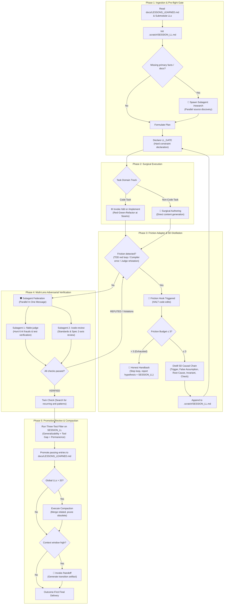

# Agent Loop Engineering (ALE)

> **"The agent forgets, the repo doesn't."**
> Standard agent loops fail because they patch local errors without understanding root causes. In step 2 the agent trips over a trap; in step 5 it trips over the exact same trap in another file. 
> ALE serves as the **Meta-Orchestrator Pipeline** that bridges specialized skills (`/tdd`, `/implement`, `/research`, `/fable-judge`, `/code-review`, `/handoff`) and transforms ephemeral runtime friction into durable, enforceable invariants.

---

## 🚀 Usage

```bash
/ale <task description>
```

When invoked, ALE acts as the supervisory engine, routing the task across the 5-phase pipeline, spawning isolated subagents for research and adversarial verification, and gating all file modifications behind `LL_GATE`.

---

## 🗺️ Master Pipeline Architecture & Skill Delegation



---

## 📋 The 5 Lifecycle Phases & Delegation Matrix

### Phase 1 — Ingestion & Pre-flight Gate
1. **Knowledge Ingestion**:
   - Read `docs/LESSONS_LEARNED.md` at repository root.
   - Read `<submodule>/LESSONS_LEARNED.md` if working within a localized domain directory.
   - Initialize `.scratch/SESSION_LL.md` (using `templates/SESSION_LL.md`).
2. **Fact Delegation (`/research`)**:
   - If the task requires unfamiliar library APIs, framework behaviors, or external documentation:
   - **Spawn `/research` in a subagent**: Do not guess signatures from memory. Wait for distilled factual findings.
3. **The `LL_GATE` Enforcement**:
   - Prior to modifying any file, emit a mandatory verbatim `LL_GATE` declaration:
     ```markdown
     LL_GATE: checked [LL-001, LL-003] - active constraints:
     - [LL-001]: Ref must be passed via props directly (React 19).
     - [LL-003]: All DB transactions must include timeout option.
     Verified: Current implementation plan strictly obeys these invariants.
     ```
   - **Hard Prohibition**: Edits executed without a preceding `LL_GATE` are considered unauthorized violations.

---

### Phase 2 — Execution Delegation
Route automatically according to the task domain:

* **Code Track**:
  - Invoke **`/tdd`** at agreed seams (or **`/implement`** for full spec execution).
  - Enforce Red-Green-Refactor: never write implementation code before a failing test exists.
* **Non-Code Track** (Specs, Docs, Marketing, Research):
  - Execute direct surgical authoring in the main thread according to domain style guidelines.

---

### Phase 3 — Friction Adapter & 5D Distillation (The Learning Engine)
The **Friction Adapter** intercepts failures across all delegated skills:
- `/tdd` red-to-green retry fails more than once.
- Terminal exit code != 0, compiler fail, or linter error.
- `/fable-judge` delivers a `REFUTED` verdict (e.g. weakened checks, false completion, spec betrayal).
- `/code-review` identifies hard standards/spec violations.
- User explicitly points out a mistake or bad assumption.

#### Protocol on Friction:
1. **Immediate Execution Halt**: Strictly prohibited from immediately modifying code to "try another syntax".
2. **Check Friction Budget**:
   - Track iteration count for the current subtask (maximum allowance: 3 cycles).
   - If budget reaches 3: **ABORT IMMEDIATELY**. Deliver an honest handback containing raw failure outputs, accumulated `SESSION_LL`, and working hypothesis.
3. **Distill 5-Dimensional Causal Chain**:
   Extract into `.scratch/SESSION_LL.md`:
   * **Trigger**: Specific surface, module, or pattern where friction occurred.
   * **False Assumption**: Flawed belief or hallucinated behavior held by the agent.
   * **Root Cause**: Objective technical or domain reality discovered.
   * **Invariant**: Enforceable positive rule preventing future recurrence.
   * **Verification Check**: Exact bash command, regex, or test to verify compliance.
4. **Re-route**: Return to Phase 1, update `LL_GATE`, and resume execution with the new invariant active.

---

### Phase 4 — Multi-Lens Verification (Subagent Federation)
Once Phase 2 reports completion, launch parallel verification subagents in **ONE message** to keep the main context clean:

1. **Adversarial Attacker Subagent (`/fable-judge`)**:
   - Re-runs claimed tests independently.
   - Hunts for 6 classic AI frauds: weakened tests, false completion, scope creep, unauthorized action, spec betrayal, and debris.
2. **Standards & Spec Subagent (`/code-review`)**:
   - Performs two-axis review: Conformance to project standards + faithfulness to spec/tickets.
3. **Aggregation**:
   - If either subagent reports `REFUTED` or severe violations: Route directly to Phase 3 as Friction.
   - If both report `VERIFIED`: Run the **Twin Check** in the main thread (search codebase for recurrence of any fixed defect).

---

### Phase 5 — Promotion Review, Compaction & Handoff
1. **The Three-Test Promotion Filter**:
   Review all entries in `.scratch/SESSION_LL.md`. Promote to `docs/LESSONS_LEARNED.md` ONLY IF it passes ALL three tests:
   * **Generalizability**: Applies to future work across the repo (not a single-line typo).
   * **Tool Gap**: Cannot be caught automatically by compilers, linters, or existing CI checks.
   * **Permanence**: Enduring architectural convention, not temporary WIP state.
2. **Compaction Gate (Rule Ceiling: 20)**:
   - If `docs/LESSONS_LEARNED.md` exceeds 20 global invariants, merge related rules and prune obsolete ones.
3. **Handoff & Report**:
   - If context usage is high or the user plans to continue in a fresh session: invoke **`/handoff`**.
   - Deliver outcome-first report displaying verification evidence and newly promoted Project LLs.
